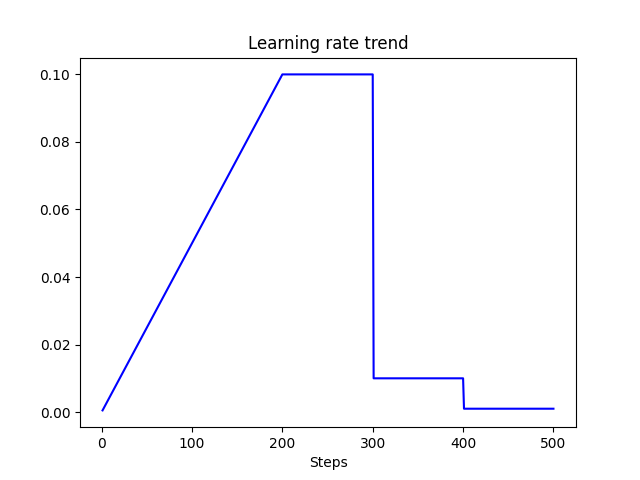

# pytorch-gradual-warmup-lr

Gradually warm-up(increasing) learning rate for pytorch's optimizer. Proposed in 'Accurate, Large Minibatch SGD: Training ImageNet in 1 Hour'.


Example : Gradual Warmup for 200 steps, after that, use MultiStepRL with milestones at 300 and 400.

## Install

```
$ pip install git+https://github.com/seo-95/pytorch-gradual-warmup-lr.git
```

## Usage

See [run.py](warmup_scheduler/run.py) file.

```python
import torch
from torch.optim.lr_scheduler import MultiLR
from torch.optim.sgd import SGD

from warmup_scheduler import GradualWarmupScheduler


if __name__ == '__main__':
    model = [torch.nn.Parameter(torch.randn(2, 2, requires_grad=True))]
    optim = SGD(model, 0.1)

    # scheduler_warmup is chained with schduler_steplr
    scheduler_steplr = MultiStepLR(optim, milestones=[300, 400], gamma=0.1)
    scheduler_warmup = GradualWarmupScheduler(optim, multiplier=1, warmup_steps=200, post_warmup_scheduler=scheduler_steplr)

    for epoch in range(1, 10):
        for step in range(1, 50):
            optim.step()
            scheduler_warmup.step()
            print(epoch, optim.param_groups[0]['lr'])
```
